# Sample Chainlink VRF Project

The purpose of this project is to provide a simple demo for using a powerful tool like Chainlink's VRFs that ensure randomness onchain. Users that attempt to recreate the functionality of our VRFNumberGen.sol should also take insights from the following documentation:

https://docs.chain.link/vrf/v2-5/getting-started

## Dependencies

[NodeJS](https://nodejs.org/en)
[Github Desktop (more user friendly GUI)](https://desktop.github.com/) or [Git SCM (used in the command line)](https://www.git-scm.com/downloads)
[Visual Studio Code (optional)](https://code.visualstudio.com/)

## Clone The Repository

### Using Github Desktop

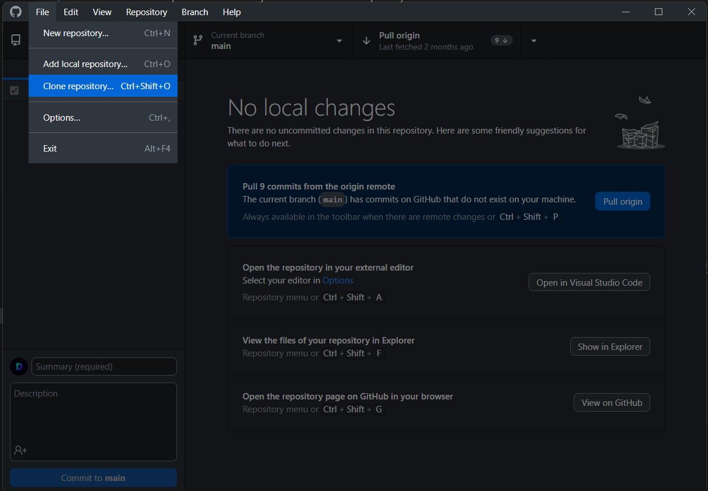

### Using Git SCM

1. Open a terminal window or Git Bash depending on how you set it up
2. Navigate to your preferred directory using a combination of "cd" (change directory), "mkdir" (make directory), "dir" (shows directory files), "ls" (shows directory files).
3. Run `git clone https://github.com/NycNode/Solidity-Getting-Started-With-Chainlink-VRF.git`.

## Setting Up A MetaMask Wallet

Use Chrome preferably

## Deploying With Remix

Go to your browser containing MetaMask

1. Create a test wallet
2. Set up the Polygon Amoy network in your Metamask's settings and fund your wallet with MATIC using a faucet. More information is available on this in the link below:

[Amoy Instructions & Faucet](https://polygon.technology/blog/introducing-the-amoy-testnet-for-polygon-pos)

3. You will also need LINK tokens for testing which can be obtained through the following URL:

[LINK Faucet](https://faucets.chain.link/polygon-amoy)

Local Terminal Inside The Cloned Project Directory

4. Run the command `npm install` in a terminal window while inside this project's directory.
   Also run `npm install -g @remix-project/remixd` to make remixd available globally for your file system.

5. Run `remixd` in the terminal, head to [Remix](https://remix.ethereum.org/) and follow the steps in the picture:

Go Back To Your Browser

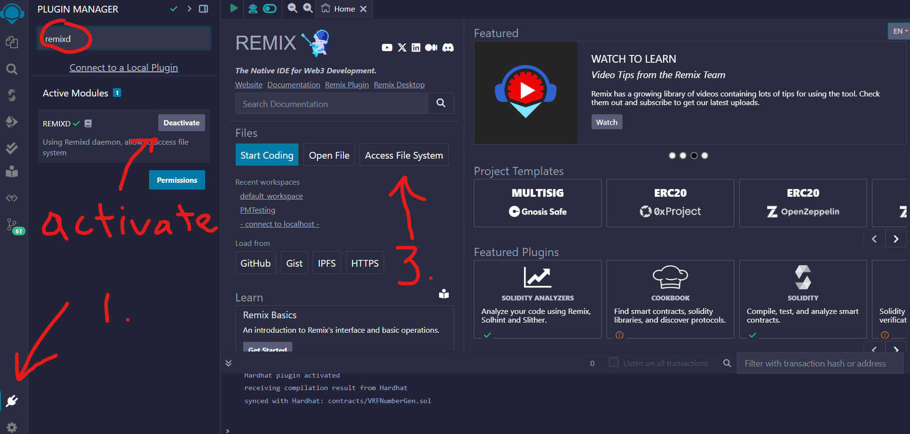

6. Open the contract file in Remix (you should be able to see the Solidity code for the VRFNumberGen.sol file)

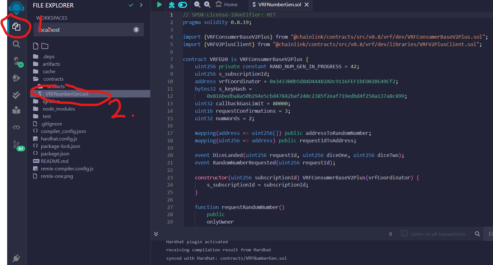

7. Make sure to compile the contract, you should have a green check mark like on step 3. in the picture below once done.

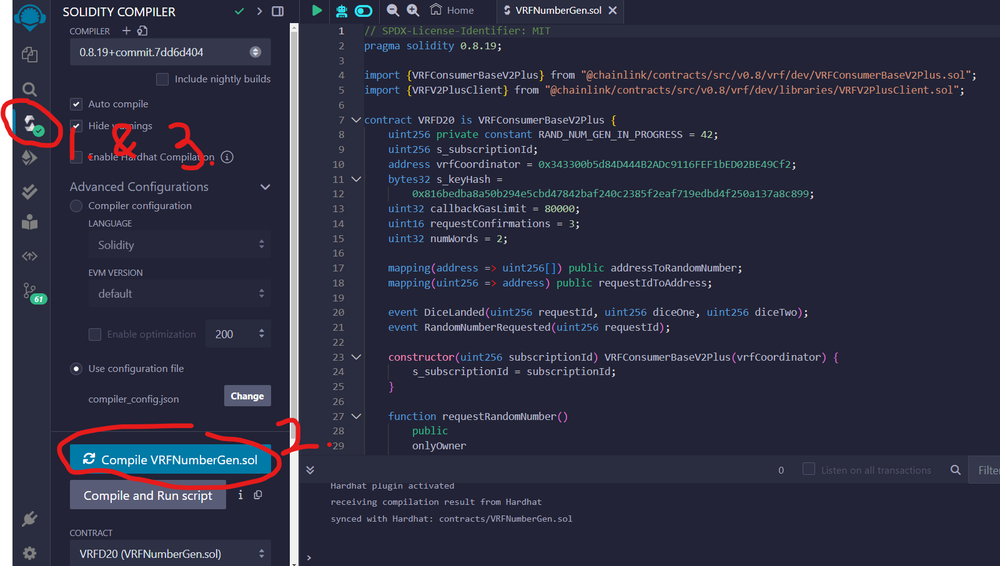

8. Connect your MetaMask to Remix

First make sure your MetaMask wallet is on the Polygon Amoy network. We added the Amoy network in step 2 so please refer back to that if you're not seeing "Polygon Amoy Testnet" in your list of networks.

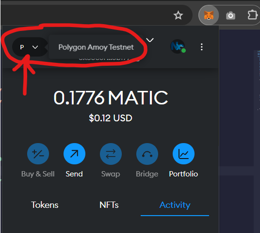

Then, connect your MetaMask wallet to Remix using the next picture as guidance.

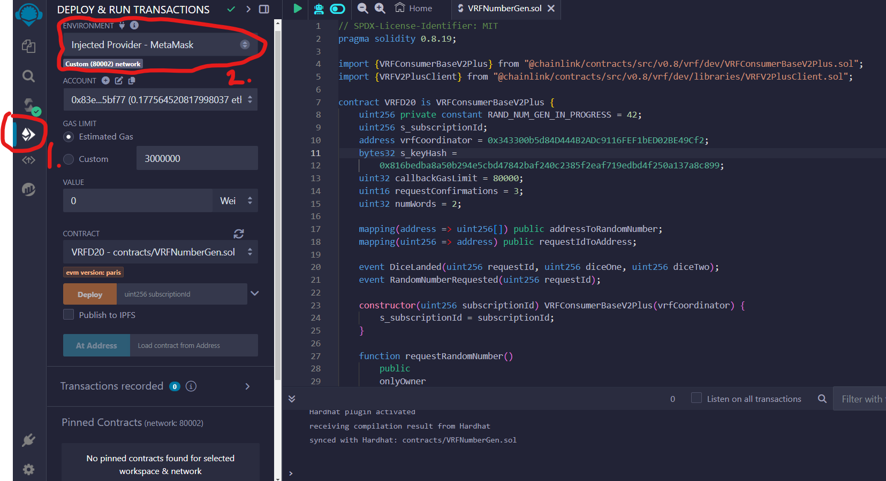

9. In order to use Chainlink's VRF service, we will have to create a subscription (no real money involved, just using test LINK and MATIC). Head over to the following link, and after entering your wallet address (can be obtained from MetaMask) paste it in as the "Admin address".

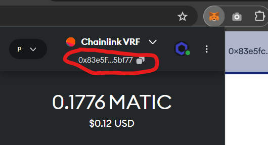

[Link To Subscribe](https://vrf.chain.link/polygon-amoy/new)

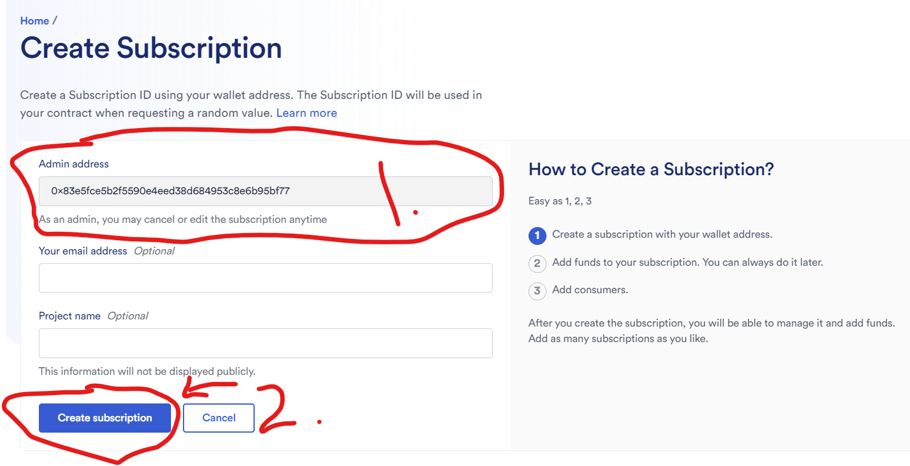

10. Continuing next steps, once you've created the subscription head to the subscription and click on it.

[Place To View Your Subscriptions](https://vrf.chain.link/polygon-amoy)

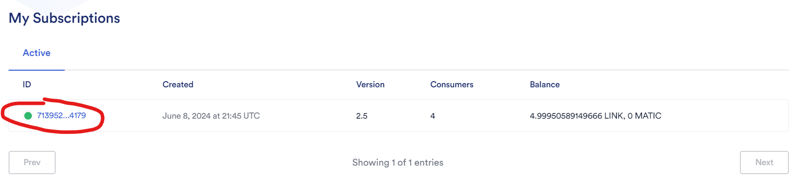

11. Copy the subscription "ID" (it'll be used when we deploy the contract). Then click "Actions" and "Fund Subscription".

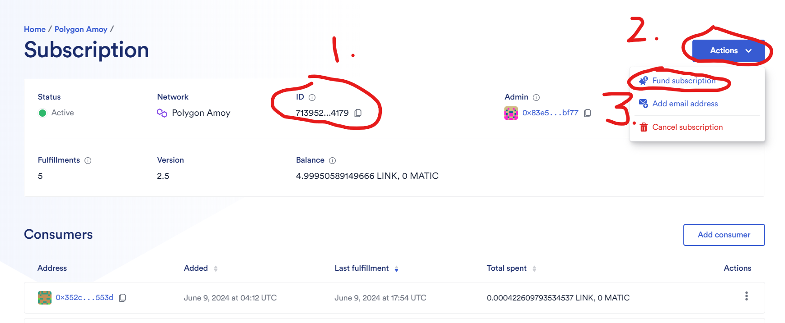

12. Earlier, one of our faucets gave us 25 LINK tokens but it might be less at your current point in time. However, funding with 5 LINK tokens should be more than enough.

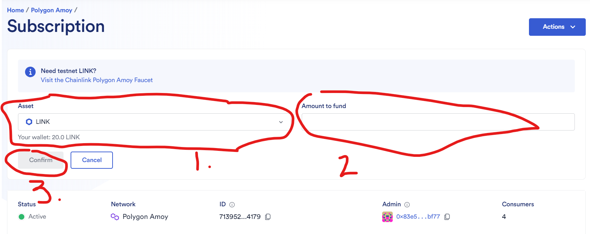

13. Go back to Remix and deploy the contract by first inputting your subscription ID that you copied earlier as a parameter. Then, MetaMask will prompt you to confirm the transaction.

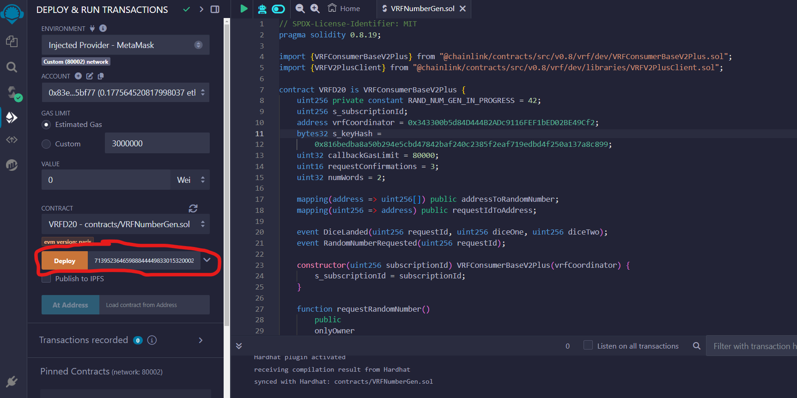

14. At this point, once the transaction is confirmed, you'll see a message like so with a green check mark in Remix's terminal. If you scroll down further on the left side of the navigation bar that you used to deploy, you should see your newly deployed contract's functions as well as it's address. Copy that address and navigate back to your VRF subscriptions (same place as in the picture for step 11).

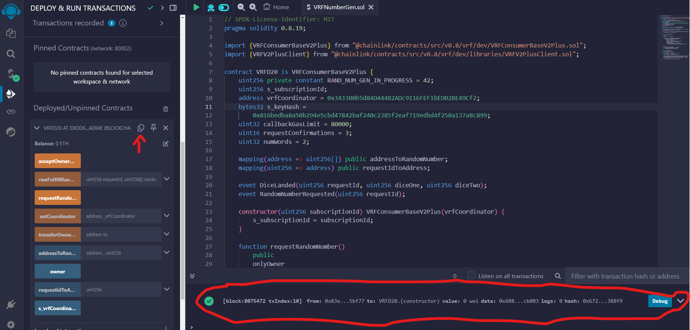

[Place To View Your Subscriptions](https://vrf.chain.link/polygon-amoy)

15. Click "Add Consumer" and paste in your contract address that we previously obtained from Remix's IDE. Now hit the next "Add Consumer" button and that will allow your contract to use your subscription. Make sure to confirm the transaction as well when prompted by MetaMask to do so.

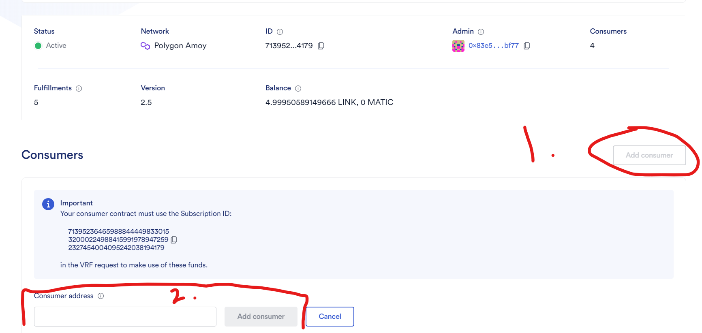

After a minute or so, refreshing the page will now show your contract address as one of the consumers for your subscription.

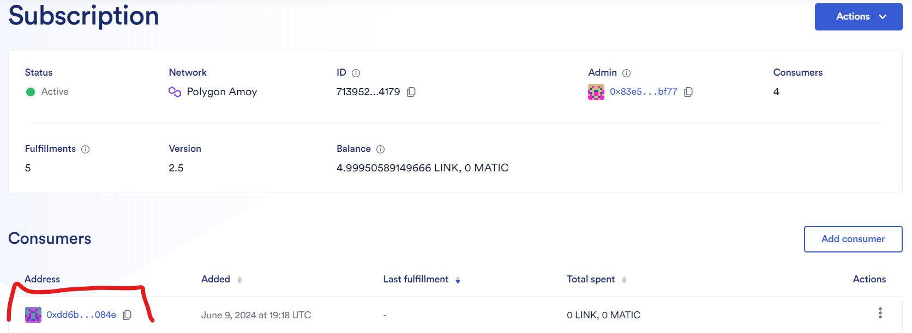

16. Go back to Remix and call the requestRandomNumber function, and confirm the MetaMask transaction thereafter.

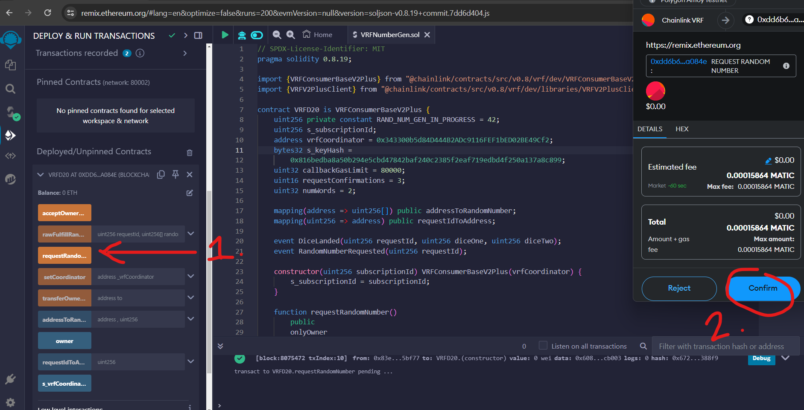

17. After 3 block confirmation or a minute/two, take your MetaMask wallet address again (same way as in the first picture of step 9) and paste it in as the first parameter for the addressToRandomNumber function. The second parameter will be 0 or 1, each representing a separate die. Call the function to display the value underneath as an unsigned integer with 256 bits.

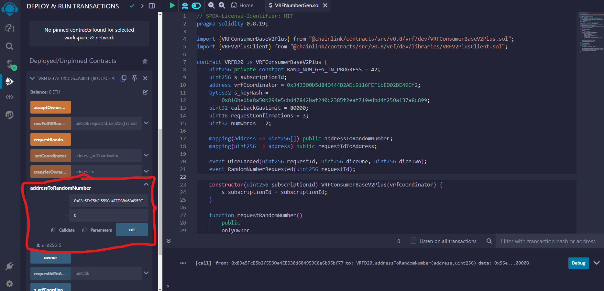

## Contributors

Daniel Chrostowski - Set up the repository
Joshua Gottlieb - Provided guidance
